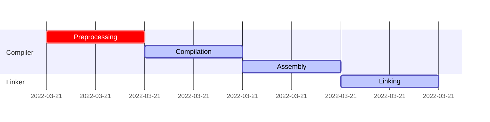
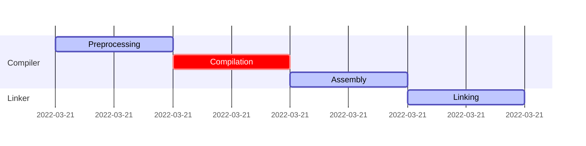
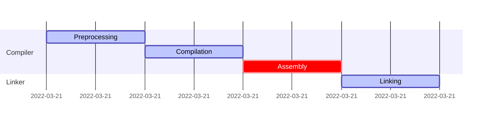
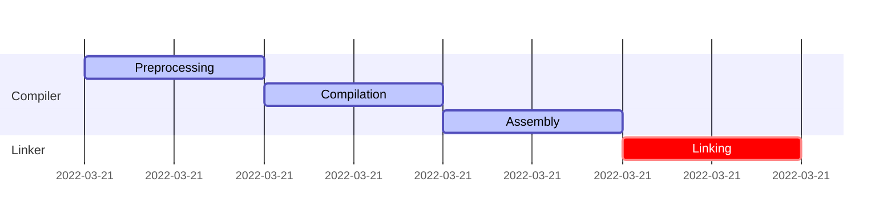

# From Source to Executable

#### Preprocessing


To get the proprocessed output of the entry file we have to do the following
```bash
$ g++ -E main.cpp
```

<table>
<tr>
<th>User Code</th>
<th>Preprocessed</th>
</tr>
<tr>
<td>

```c++
#define POSITIVE_ERRORS

//#include "utilities.hpp"
#define RET_VAL_OK 0
#ifdef POSITIVE_ERRORS
    #define RET_VAL_ERR 1
#else
    #define RET_VAL_ERR -1
#endif

#define CONCAT(a, b) a##b

#define SUM(a, b) a + b + __cplusplus

int sum(int a, int b) {
    return SUM(a, b);
}

#define PROCESS_THE_ENTIRE_FILE

/*
 * This is a comment
 */
int main(int argc, char* argv[]) {
    #line 300 "program.cpp"
    if(CONCAT(arg, c) != 3) {
        return RET_VAL_ERR;
    }
    if(sum(4, 5) > __LINE__) {
        return RET_VAL_ERR;
    }
    #ifndef PROCESS_THE_ENTIRE_FILE
        #error "Flag set to not process entire file for demo purpose"
    #endif
    return __TIME__;
}
```

</td>
<td>

```c++
# 1 "main.cpp"
# 1 "<built-in>" 1
# 1 "<built-in>" 3
# 414 "<built-in>" 3
# 1 "<command line>" 1
# 1 "<built-in>" 2
# 1 "main.cpp" 2

# 1 "./utilities.hpp" 1
# 12 "./utilities.hpp"
int sum(int a, int b) {
    return a + b + 199711L;
}
# 3 "main.cpp" 2


int main(int argc, char* argv[]) {
# 300 "program.cpp"
 if(argc != 3) {
        return 1;
    }
    if(sum(4, 5) > 303) {
        return 1;
    }


    return "14:08:18";
}
```

</td>
</tr>
</table>

#### Compilation


To get the compiler output (assembly language) output from the preprocessed file we need to issue the below command
```zsh
$ g++ -S main.cpp
```

Below table examples are obtained using the optimization `-O3` when compiling so that the output is reduced significantly.
<table>
<tr>
<th>User Code</th>
<th>Compiled arm64e</th>
<th>Compiled x86_64</th>
</tr>
<tr>
<td>

```c++
template<typename T>
T sum(T a, T b) {
    return a + b;
};             

int main() {
    int iRes = sum<int>(1, 2);
    int dRes = sum<double>(1.0, 2.0);
    return iRes + dRes;
}
```

</td>
<td>

```c++
        .section        __TEXT,__text,regular,pure_instructions
        .build_version macos, 12, 0     sdk_version 12, 3
        .globl  _main                           ; -- Begin function main
        .p2align        2
_main:                                  ; @main
        .cfi_startproc
; %bb.0:
        mov     w0, #6
        ret
        .cfi_endproc
                                        ; -- End function
.subsections_via_symbols
```

</td>
<td>

```c++
        .section        __TEXT,__text,regular,pure_instructions
        .build_version macos, 12, 0     sdk_version 12, 3
        .globl  _main                           ## -- Begin function main
        .p2align        4, 0x90
_main:                                  ## @main
        .cfi_startproc
## %bb.0:
        pushq   %rbp
        .cfi_def_cfa_offset 16
        .cfi_offset %rbp, -16
        movq    %rsp, %rbp
        .cfi_def_cfa_register %rbp
        movl    $6, %eax
        popq    %rbp
        retq
        .cfi_endproc
                                        ## -- End function
.subsections_via_symbols
```

</td>
</tr>
</table>

#### Assembly


The compiled code (machine code) is still text based however the computer works best with binary data so that is why we must put the output through an assembler and generate an `object file`.
The instructions to do this are below
```bash
$ g++ -c main.cpp
```

From this point on the output files are no longer readable and for analyzing them we will be using a series of tools such as `nm` and `objdump`.

<table>
<tr>
<th>User Code</th>
<th>Object file (shown using nm)</th>
</tr>
<tr>
<td>

```c++
int globalDefinedVar = 56;
int globalUndefinedVar;

double prototype();

int defined() {
    return 6;
}

extern int VAL;

int main()
{
    return globalDefinedVar + 
           globalUndefinedVar + 
           prototype() + 
           defined() +
           VAL;
}
```

</td>
<td>

```c++
                 U _VAL
0000000000000000 T __Z7definedv
                 U __Z9prototypev
0000000000000084 D _globalDefinedVar
00000000000000c8 S _globalUndefinedVar
0000000000000008 T _main
0000000000000000 t ltmp0
0000000000000084 d ltmp1
00000000000000c8 s ltmp2
0000000000000088 s ltmp3
```

</td>
</tr>
</table>

#### Linking


This is something to have in mind. All the processes before have worked on a single translation unit while the linker, due to the above shown undefined symbols, needs to take in multiple input files as to solve the undefined symbols by looking at things such as other object files, static libraries and dynamic libraries.

As such trying to link the previous file in the Assembly example will throw explicit linker errors like below:
```bash
Undefined symbols for architecture arm64:
  "_VAL", referenced from:
      _main in main.o
  "__Z9prototypev", referenced from:
      _main in main.o
ld: symbol(s) not found for architecture arm64
```
We can see the errors are exactly related to the two `undefined` symbols in the object file for which now the linker cannot move forward until it gets informations about them.

For ilustrating linking we will start from the below project. A simple application which uses a function from a different C++ source file exposed via a header file.

```c++
// utils.hpp
int sum(int, int);
```

```c++
// utils.cpp
#include "utils.hpp"

int sum(int a, int b) {
    return a + b;
}
```

```c++
// main.cpp
#include "utils.hpp"

int main() {
    return sum(4, 5);
}
```

We can generate object files from both translation units just fine but we won't be able to provide any single object file independently to the linker to generate an executable for the reasons below:

```bash
$ ld utils.o
Undefined symbols for architecture arm64:
  "_main", referenced from:
     implicit entry/start for main executable
ld: symbol(s) not found for architecture arm64
$ ld main.o
Undefined symbols for architecture arm64:
  "__Z3sumii", referenced from:
      _main in main.o
ld: symbol(s) not found for architecture arm64
```


#### Static libraries


#### Dynamic libraries


#### Makefiles


#### CMake


#### Other resource