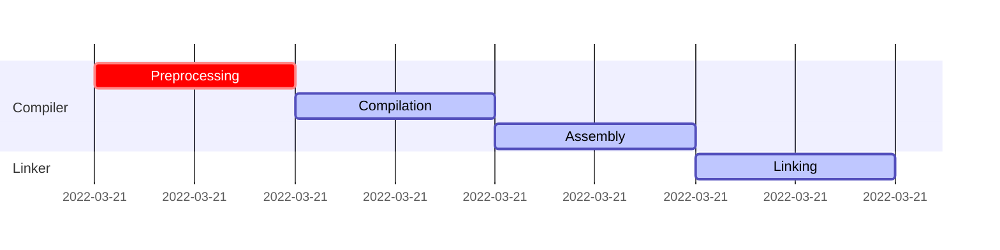
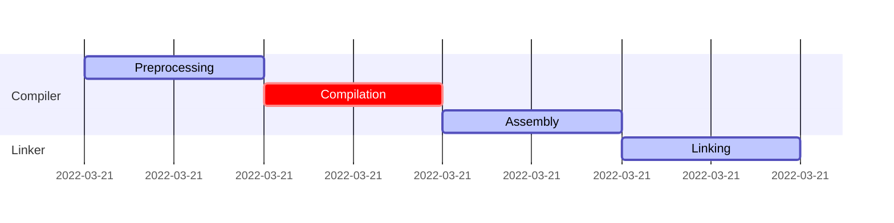
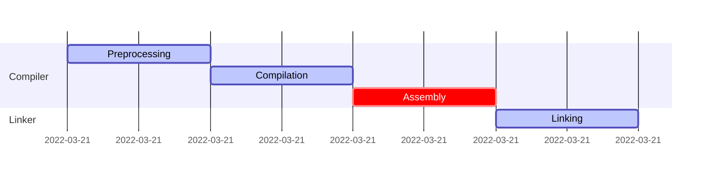
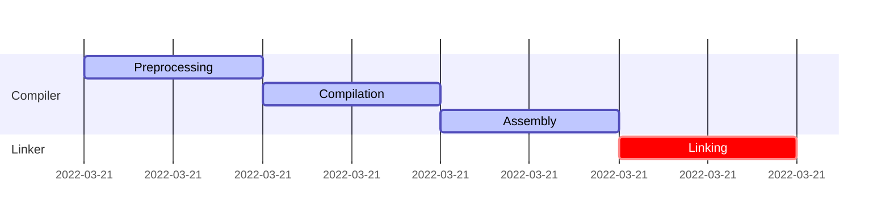

# From Source to Executable

#### Preprocessing


To get the proprocessed output of the above code we have to do the following
```zsh
$ g++ -E main.cpp
```

<table>
<tr>
<th>User Code</th>
<th>Preprocessed</th>
</tr>
<tr>
<td>

```c++
#define POSITIVE_ERRORS

//#include "utilities.hpp"
#define RET_VAL_OK 0
#ifdef POSITIVE_ERRORS
    #define RET_VAL_ERR 1
#else
    #define RET_VAL_ERR -1
#endif

#define CONCAT(a, b) a##b

#define SUM(a, b) a + b + __cplusplus

int sum(int a, int b) {
    return SUM(a, b);
}

#define PROCESS_THE_ENTIRE_FILE

/*
 * This is a comment
 */
int main(int argc, char* argv[]) {
    #line 300 "program.cpp"
    if(CONCAT(arg, c) != 3) {
        return RET_VAL_ERR;
    }
    if(sum(4, 5) > __LINE__) {
        return RET_VAL_ERR;
    }
    #ifndef PROCESS_THE_ENTIRE_FILE
        #error "Flag set to not process entire file for demo purpose"
    #endif
    return __TIME__;
}
```

</td>
<td>

```c++
# 1 "main.cpp"
# 1 "<built-in>" 1
# 1 "<built-in>" 3
# 414 "<built-in>" 3
# 1 "<command line>" 1
# 1 "<built-in>" 2
# 1 "main.cpp" 2

# 1 "./utilities.hpp" 1
# 12 "./utilities.hpp"
int sum(int a, int b) {
    return a + b + 199711L;
}
# 3 "main.cpp" 2


int main(int argc, char* argv[]) {
# 300 "program.cpp"
 if(argc != 3) {
        return 1;
    }
    if(sum(4, 5) > 303) {
        return 1;
    }


    return "14:08:18";
}
```

</td>
</tr>
</table>

#### Compilation



#### Assembly

#### Linking

#### Static libraries
#### Dynamic libraries
#### Makefiles
#### CMake
#### Other resource